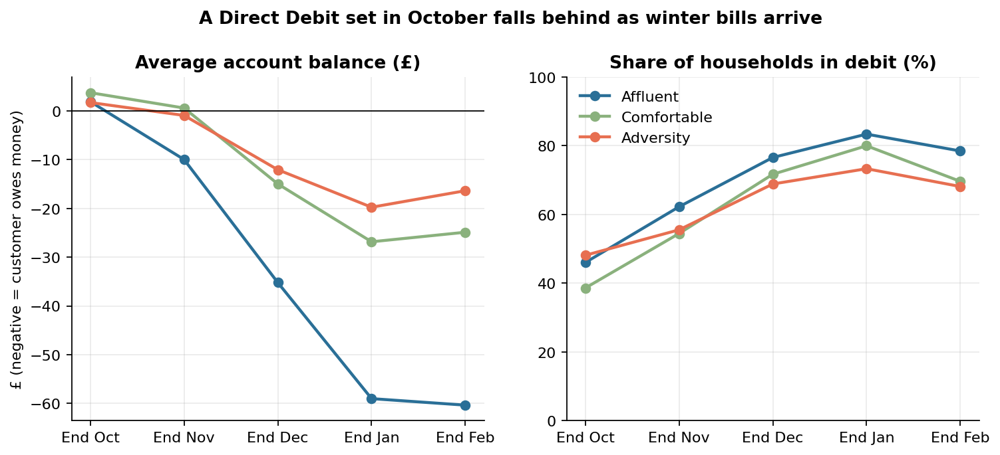
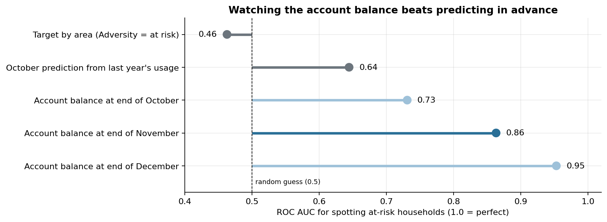
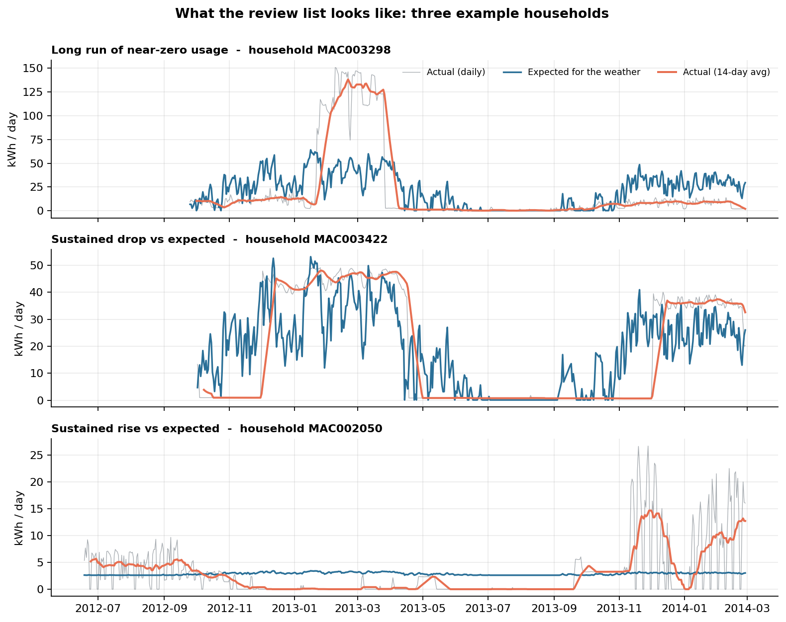
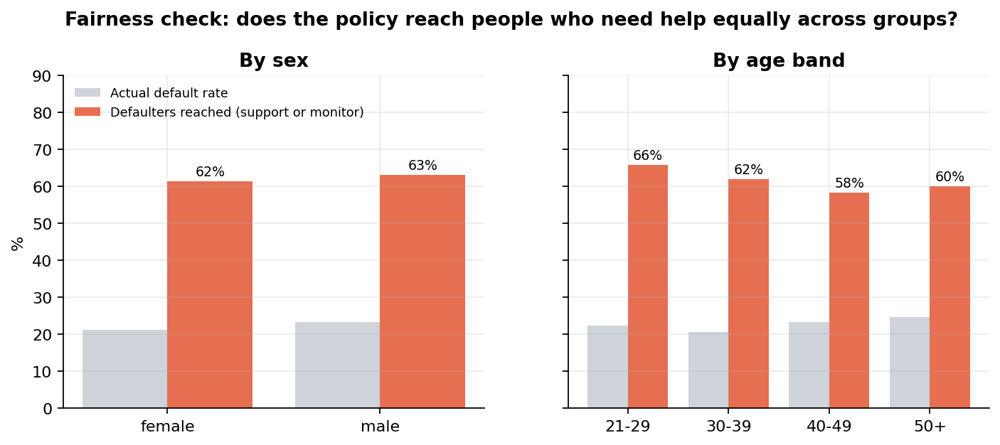

# Winter Bill Risk: spotting energy customers heading into debt, and helping them early

An end-to-end analytics project built for the kind of work an energy supplier's **credit risk and collections team** does: understanding why customers fall behind on bills, finding them early, flagging suspicious meter readings, and turning a risk model into a **fair support policy**.

Built with **SQL (dbt + DuckDB)**, **Python (pandas, scikit-learn, matplotlib)** and **Tableau**, using **real public data**: 366,642 days of smart meter readings from 600 London households, and payment histories for 30,000 credit customers.

---

## Key findings

**1. A Direct Debit set in October falls behind every winter.**
Priced at today's rates (Ofgem cap, Oct-Dec 2026), the average household's electricity Direct Debit is **£113/month**. Winter use is 28-41% higher than summer, so by the end of January **80% of households are in debit**, owing £41 on average. **31%** fall behind by at least half a month's payment at some point.



**2. Watching the account beats predicting in advance, and targeting by area doesn't work.**
Treating "Adversity" areas as at-risk is *worse than a coin toss* at finding who falls behind (AUC 0.46). A model using last year's usage does better (0.64), but the account balance at the end of November is far stronger (**0.86**).
**Recommended trigger:** contact customers who are ≥10% of a monthly payment behind at the end of November. This reaches **77% of at-risk households** while contacting only a third of customers, and **71%** of those contacted genuinely need help.



**3. 34 of 597 homes (6%) have meter readings worth a closer look.**
Transparent rules (weeks of near-zero use, usage far below what the weather predicts, data gaps) plus an Isolation Forest produce a ranked review list. Each home gets a *likely explanation*: most are probably empty homes or meter faults rather than fraud, so the first step is a check, never an accusation.



**4. A payment-risk model that is accurate *and* fair.**
A gradient boosting model (test AUC **0.78**) uses only payment behaviour; no sex, age, marital status or education. Adding those characteristics would improve AUC by just 0.001, so leaving them out costs almost nothing. The top 10% of scores miss a payment **69%** of the time (3x the average). The policy reaches defaulters at near-equal rates for men and women (ratio 0.98) and across age bands (0.89, lowest for 40-49s, which is flagged for monitoring).



**5. Bonus: households on a dynamic time-of-use tariff used ~5% less electricity** than similar standard-tariff homes (95% interval: -9% to -1%), measured with a difference-in-differences design.

## Recommendations

| Segment (end of November) | Households | At risk | Action |
|---|---|---|---|
| 1. Behind ≥10% **and** in an Adversity area | 43 | 60% | **Priority support:** personal call, payment plan into spring, check support-scheme eligibility, record vulnerability |
| 2. Behind ≥10%, other areas | 139 | 75% | **Direct Debit review:** automated message suggesting an updated amount |
| 3. Not behind, Adversity area | 92 | 8% | **Light-touch information:** winter tips and where to get help |
| 4. Not behind, other areas | 271 | 11% | Standard service |

Area is used to decide *how* to help, never *whether* someone is flagged; the trigger itself is based only on the account.

Full write-up: [`reports/findings.md`](reports/findings.md) · Methods and limitations: [`docs/methodology.md`](docs/methodology.md)

**Slides:** `reports/winter_bill_risk_slides.pdf` · **Tableau dashboards:** [Tableau Public link, add after publishing]

---

## How it works

```
data/raw (CSV)  ──►  dbt + DuckDB  ──►  data/marts (CSV)  ──►  Python analysis  ──►  charts, metrics,
                     staging → intermediate → marts             (4 scripts)           Tableau outputs
                     + 36 data tests
```

```
winter-bill-risk/
├── dbt/                      SQL pipeline (dbt-duckdb)
│   ├── models/staging/       clean + rename raw data (incl. weather timezone fix)
│   ├── models/intermediate/  weather-adjusted expected usage per household-day
│   ├── models/marts/         monthly bills, Direct Debit simulation, anomaly signals, credit features
│   └── tests/                custom data tests (e.g. balances reconcile to the penny)
├── analysis/                 01 winter debt · 02 meter anomalies · 03 payment risk · 04 smart tariff
├── scripts/                  export marts to CSV · reconciliation check
├── reports/                  findings.md, figures/, metrics/ (JSON)
├── tableau/                  dashboard design spec
├── docs/                     methodology, data sources, how AI was used
└── data/                     raw data (not committed), marts and outputs (generated)
```

**A data-quality catch worth mentioning:** the weather file stores timestamps in UTC, so every day during British Summer Time appears as 23:00 on the *previous* day (428 of 882 rows). A simple date conversion shifts all summer weather by a day and creates duplicate dates. The staging model fixes this, and a dbt test checks that no days are missing.

## Run it yourself (Mac)

```bash
git clone https://github.com/<your-username>/winter-bill-risk.git
cd winter-bill-risk
python3 -m venv .venv && source .venv/bin/activate
make setup
# download the data into data/raw/ (see docs/data_sources.md), then:
make all        # dbt build + tests → export → reconciliation check → analyses
```

## Data

- **Smart meters:** Low Carbon London trial (UK Power Networks), daily summaries via Kaggle "Smart meters in London". 12 blocks, 600 households: 298 Affluent, 150 Comfortable, 150 Adversity (Acorn), 189 on the dynamic tariff.
- **Weather:** Dark Sky daily London weather (same Kaggle dataset).
- **Credit:** UCI "Default of Credit Card Clients" (Yeh & Lien, 2009), 30,000 customers.
- **Prices:** Ofgem energy price cap, 1 Oct-31 Dec 2026, GB average Direct Debit electricity rates.

Raw data is not redistributed here. See [`docs/data_sources.md`](docs/data_sources.md) for download links and licences.

## How AI was used

AI tools were used to speed up writing SQL and Python. Every result was checked: dbt data tests, a reconciliation script comparing pipeline outputs with independent calculations, and manual inspection of flagged households. Details: [`docs/ai_usage.md`](docs/ai_usage.md).

## Author

**Raman D.** · [LinkedIn](https://www.linkedin.com/in/raman-deshlahre/) · Data Analyst, London
